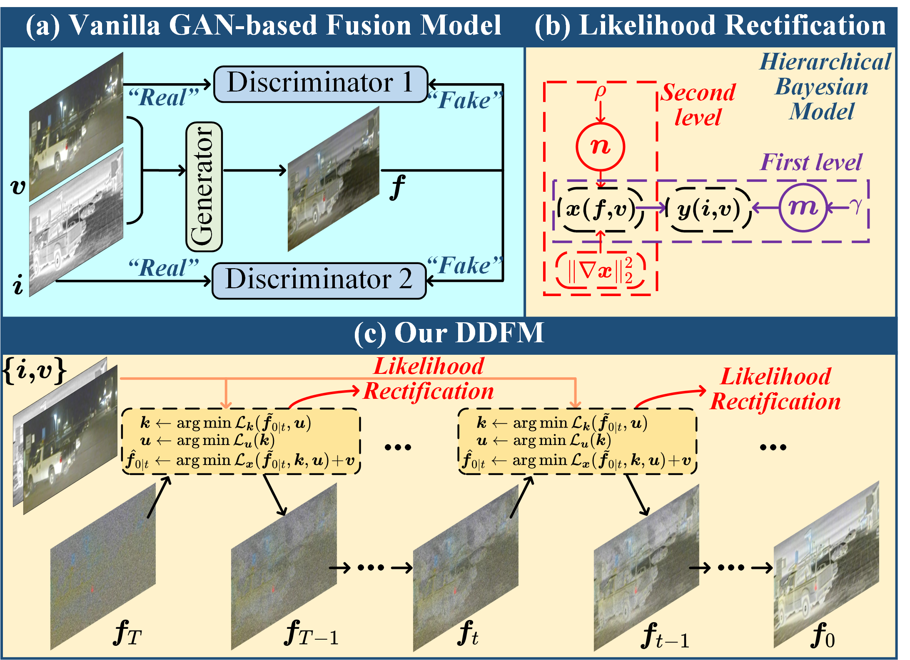
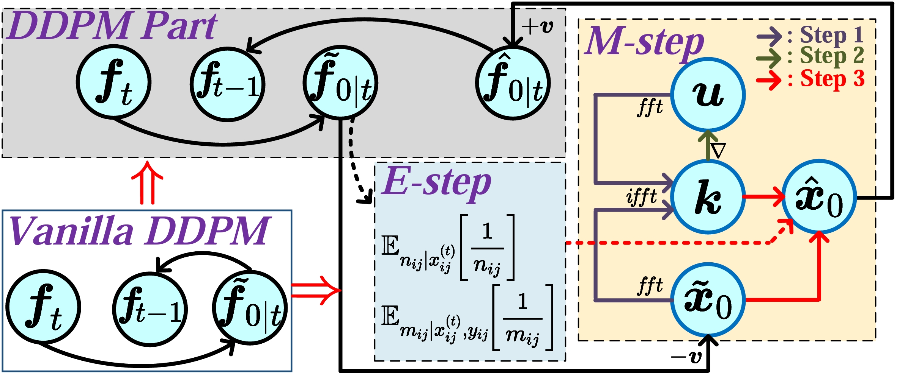
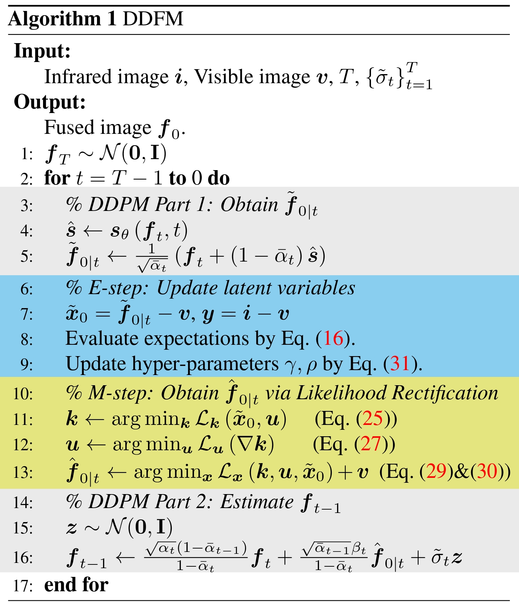
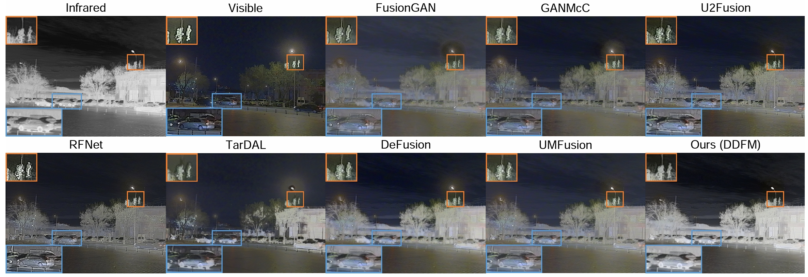
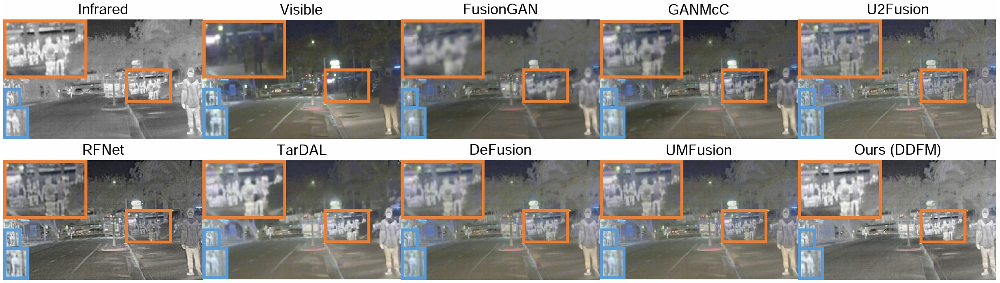
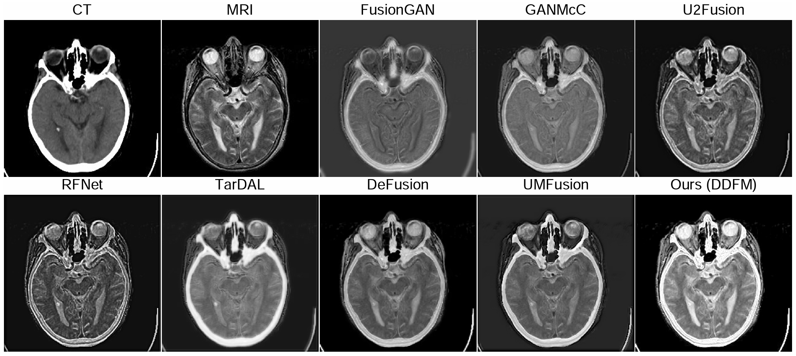
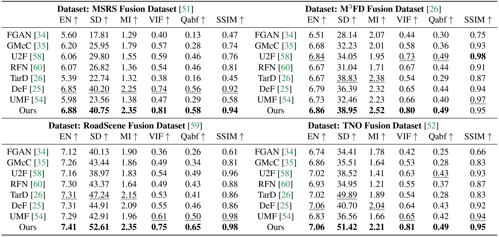
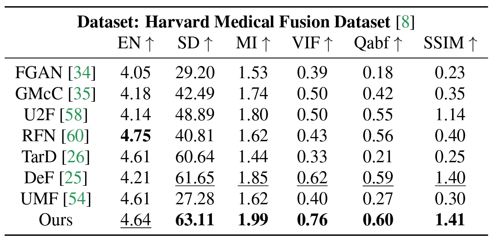

# DDFM

Codes for ***DDFM: Denoising Diffusion Model for Multi-Modality Image Fusion. (ICCV 2023 Oral)***

[Zixiang Zhao](https://zhaozixiang1228.github.io/), [Haowen Bai](), [Yuanzhi Zhu](https://yuanzhi-zhu.github.io/about/), [Jiangshe Zhang](http://gr.xjtu.edu.cn/web/jszhang), [Shuang Xu](https://shuangxu96.github.io/), [Yulun Zhang](https://yulunzhang.com/), [Kai Zhang](https://cszn.github.io/), [Deyu Meng](https://gr.xjtu.edu.cn/en/web/dymeng), [Radu Timofte](https://www.informatik.uni-wuerzburg.de/computervision/home/) and [Luc Van Gool](https://vision.ee.ethz.ch/people-details.OTAyMzM=.TGlzdC8zMjQ4LC0xOTcxNDY1MTc4.html).

-[*[Paper]*](https://openaccess.thecvf.com/content/ICCV2023/html/Zhao_DDFM_Denoising_Diffusion_Model_for_Multi-Modality_Image_Fusion_ICCV_2023_paper.html)
-[*[ArXiv]*](https://arxiv.org/abs/2303.06840)
-[*[Supplementary Materials]*](https://openaccess.thecvf.com/content/ICCV2023/supplemental/Zhao_DDFM_Denoising_Diffusion_ICCV_2023_supplemental.pdf)

## Update

- [2023-9] Codes and config files are public available.

## Citation

```
@InProceedings{Zhao_2023_ICCV,
    author    = {Zhao, Zixiang and Bai, Haowen and Zhu, Yuanzhi and Zhang, Jiangshe and Xu, Shuang and Zhang, Yulun and Zhang, Kai and Meng, Deyu and Timofte, Radu and Van Gool, Luc},
    title     = {DDFM: Denoising Diffusion Model for Multi-Modality Image Fusion},
    booktitle = {Proceedings of the IEEE/CVF International Conference on Computer Vision (ICCV)},
    month     = {October},
    year      = {2023},
    pages     = {8082-8093}
}
```

## Abstract

Multi-modality image fusion aims to combine different modalities to produce fused images that retain the complementary features of each modality, such as functional highlights and texture details. To leverage strong generative priors and address challenges such as unstable training and lack of interpretability for GAN-based generative methods, we propose a novel fusion algorithm based on the denoising diffusion probabilistic model (DDPM). The fusion task is formulated as a conditional generation problem under the DDPM sampling framework, which is further divided into an unconditional generation subproblem and a maximum likelihood subproblem. The latter is modeled in a hierarchical Bayesian manner with latent variables and inferred by the expectation-maximization (EM) algorithm. By integrating the inference solution into the diffusion sampling iteration, our method can generate high-quality fused images with natural image generative priors and cross-modality information from source images. Note that all we required is an unconditional pre-trained generative model, and no fine-tuning is needed. Our extensive experiments indicate that our approach yields promising fusion results in infrared-visible image fusion and medical image fusion.

### 🌐 Usage

### ⚙ 1. Virtual Environment

```
# create virtual environment
conda create -n DDFM python=3.8.10
conda activate DDFM
# select pytorch version yourself
# install DDFM requirements
pip install -r requirements.txt
```

### 📃 2. Pre-trained Checkpoint Preparation

From [the link](https://github.com/openai/guided-diffusion), download the checkpoint "256x256_diffusion_uncond.pt" and paste it to ``'./models/'``.

### 🏊 3. Data Preparation

Download the Infrared-Visible Fusion (IVF) and Medical Image Fusion (MIF) dataset and place the paired images in the folder ``'./input/'``.

### 🏄 4. Inference (Sampling)

If you want to infer with our DDFM and obtain the fusion results in our paper, please run

```
python sample.py
```

Then, the fused results will be saved in the ``'./output/recon/'`` folder.

Additionally,

- **[Random seed]:** For the randomly generated seed settings, we adopt the settings [seed = 3407](https://arxiv.org/abs/2109.08203) (purely for fun, you can change it arbitrarily to obtain different sampling results).
- **[Sampling speed]:** Regarding the sampling speed, we use ``timestep_respacing: 100`` in the ``configs`` file (with a maximum setting of 1000). A larger ``timestep_respacing`` will result in better generation outcomes, but will take more time to sample.
- **[Step-by-step sampling results]:** If you want to save the sampling results of each step, please set ``record=True`` in ``sample.py``. The step-by-step sampling results will be saved in the ``'./output/progress/'`` folder.

## 🙌 DDFM

### Illustration of our DDFM model.



### Detail of DDFM.





### Qualitative fusion results.







### Quantitative fusion results.

Infrared-Visible Image Fusion



Medical Image Fusion



## 📖 Related Work

- Zixiang Zhao, Haowen Bai, Jiangshe Zhang, Yulun Zhang, Kai Zhang, Shuang Xu, Dongdong Chen, Radu Timofte, Luc Van Gool. *Equivariant Multi-Modality Image Fusion.* **arXiv:2305.11443**, https://arxiv.org/abs/2305.11443
- Zixiang Zhao, Haowen Bai, Jiangshe Zhang, Yulun Zhang, Shuang Xu, Zudi Lin, Radu Timofte, Luc Van Gool.
  *CDDFuse: Correlation-Driven Dual-Branch Feature Decomposition for Multi-Modality Image Fusion.* **CVPR 2023**, https://arxiv.org/abs/2211.14461
- Zixiang Zhao, Shuang Xu, Chunxia Zhang, Junmin Liu, Jiangshe Zhang and Pengfei Li. *DIDFuse: Deep Image Decomposition for Infrared and Visible Image Fusion.* **IJCAI 2020**, https://www.ijcai.org/Proceedings/2020/135.
- Zixiang Zhao, Shuang Xu, Jiangshe Zhang, Chengyang Liang, Chunxia Zhang and Junmin Liu. *Efficient and Model-Based Infrared and Visible Image Fusion via Algorithm Unrolling.* **IEEE Transactions on Circuits and Systems for Video Technology 2021**, https://ieeexplore.ieee.org/document/9416456.
- Zixiang Zhao, Jiangshe Zhang, Haowen Bai, Yicheng Wang, Yukun Cui, Lilun Deng, Kai Sun, Chunxia Zhang, Junmin Liu, Shuang Xu. *Deep Convolutional Sparse Coding Networks for Interpretable Image Fusion.* **CVPR Workshop 2023**. https://robustart.github.io/long_paper/26.pdf.
- Zixiang Zhao, Shuang Xu, Chunxia Zhang, Junmin Liu, Jiangshe Zhang. *Bayesian fusion for infrared and visible images.* **Signal Processing**, https://doi.org/10.1016/j.sigpro.2020.107734.
